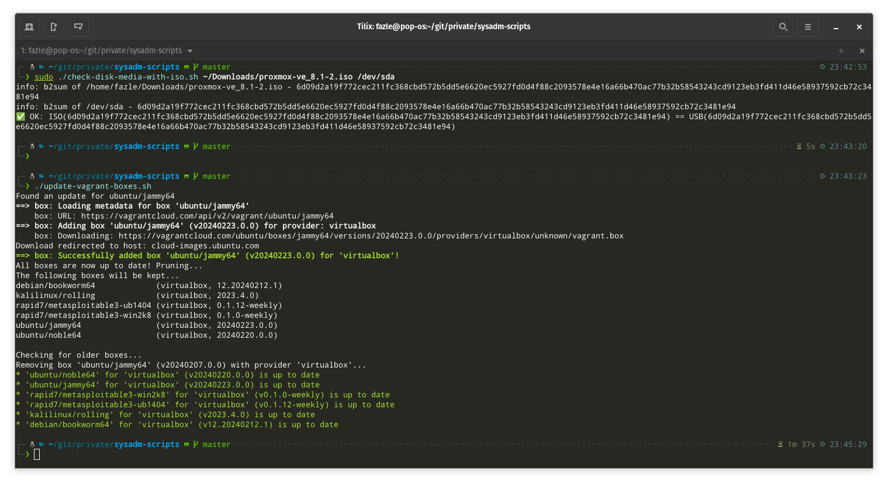

# sysadm-tools

Collection of System Admin's tools for those things which still needs to be done manually

- `hostid.sh`
- `ssh-copy-id-auto.sh`
- `check-disk-media-with-iso.sh`
- `update-vagrant-boxes.sh`

---

## `hostid.sh`

This script lets you create your hostid of your choice on the host. You can either provide the hostid you want or you can choose to write the current hostid to `/etc/hosts`. Writing the hostid to `/etc/hosts` makes sure your hosid remains the same, say, even when you change your ip address.

The `hostid` command lets you see the current hostid.

---

## `myssh.sh`

This script can be used instead of the `ssh` command. It tries to ssh to a server using key-based auth, and if fails, copies the key to the server and tries to ssh again.

---

## `ssh-copy-id-auto.sh`

This script let you copy your ssh-key to your servers for passwordless authentication. This script will help you in a situation where you have a thousand servers in which you want to copy your ssh-key. You can use ssh-copy-id command but it will ask you your password a thousand times. Even if you do automate that, ssh-copy-id will copy to one server at a time which is painfully slow for a thousand servers.

### Prerequisite

- You will need to install the `sshpass` package
- You will need to have your password in plain-text or in base64 encoding (adding a bit of extra security) in a file. Change the `$Pwd_File`
- If you happen to encode your password in base64, flip the value of `$Base64_Enc`

---

## `check-disk-media-with-iso.sh`

This script checks if a usb disk you created from a iso file using tools like `dd` is not corrupted. To check the integrity of the USB disk you created using `dd`, you will need the iso file and USB disk device (e.g. /dev/sdb).

This script is useful when you want to check, for example, a bootable USB Disk you created for Ubuntu from a Ubuntu iso image is not corrupted.

Note: you might need to run this script with `sudo` privileges otherwise it may not be able to read the USB disk device.

---

## `update-vagrant-boxes.sh`

This script upgrades all your installed [vagrant](https://www.vagrantup.com/) boxes and purges old versions of the boxes.

---

## Donations

Bitcoin (BTC): `bc1qzlhpm94vtk2ht67etdutzcy2g5an5v6g36tp0m`
